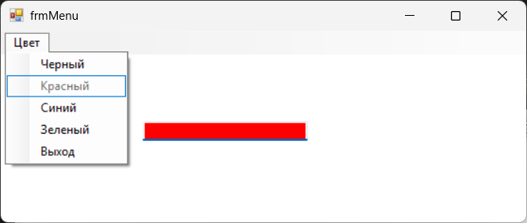

# Лабораторная работа 3

### Описание задания:
Разработайте приложение, которое изменяет задний фон текстового поля из
предыдущего занятия, реализовав эту функцию с помощью меню формы

### Цель
Целью данного урока является ознакомление с элементом
управления MenuStrip при работе в visual c# с формами.

---
### Интерфейс главной формы (frmMenu.cs)

Название проекта: `Lab3`, название файла формы `frmMenu.cs`

---

### Инструментарий

| Объект              | Свойство `Name` |
|---------------------|-----------------|
| **Форма**           | `frmMenu`    	 |
| **Меню формы**      | `MenuStrip1`    |

---
